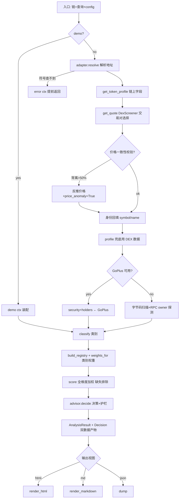

# 链上代币取证分析 · 可复用技能设计

> 文档定位：把四轮迭代沉淀的 `src/chain` 链上分析能力固化为**跨项目、可配置、可一键调用**的分析技能。
> 适用对象：本仓库后续开发、以及任何需要「给一条链 + 一个地址/符号 → 得到多维安全与投资决策分析」的 AI/脚本工作流。
> 状态：**v1 已完整实现并验证（2026-09-03）**。Phase 0–5 全部落地；`tests/chain` 38 项测试通过；
> live 冒烟（真实 BNB 合约 bibi）通过。实现要点与偏差见文末「§10 实现记录」。

---

## 0. 目标与设计原则

| # | 原则 | 含义 |
|---|------|------|
| P1 | 输入极简、输出稳定 | 输入「链 + 地址/符号（+可选配置覆盖）」；输出固定 JSON Schema + 双格式报告，结构可被下游程序消费 |
| P2 | 缺数据不崩、显式降级 | 任意数据源失败（RPC/浏览器/GoPlus/DexScreener）返回空模型或 None，缺失维度被加权器显式排除，绝不伪造中间值 |
| P3 | 阈值外置、策略可配 | 权重、band、决策档位、护栏、交易对选择、价格校验等魔法数全部进配置，代码零魔法数 |
| P4 | 引擎与渲染解耦 | 分析引擎只产 `AnalysisResult`+`Decision`（纯数据），HTML/Markdown/JSON 渲染为独立可插拔输出层 |
| P5 | 能力跨项目复用 | 引擎不绑定 `D:\gitpro\claude_trading` 工作目录；通过「技能包 + 引擎包」双形态在任何项目一键调用 |
| P6 | 迁移只做加法、以测试兜底 | 重构前先冻结 golden 基线；每阶段可独立交付、可回滚 |

---

## 1. 输入 / 输出契约（Contract）

### 1.1 输入

| 层 | 形态 | 示例 |
|----|------|------|
| CLI | `analyze_token.py --chain bnb --address 0x… [--config x.yaml] [--out a.html --json]` | 直接命令行 |
| 程序 API | `analyze(chain, query, *, config: Config, demo=False) -> AnalysisResult, Decision` | Python 调用 |
| 结构化请求（未来 JSON-RPC/HTTP） | `{"chain":"bnb","address":"0x…","config":"default|meme_strict","out":["json","html"]}` | 未来网关 |

**规范参数（均可被 config 覆盖）：**
`chain`（bnb/sol/robinhood）· `query`（地址或符号）· `rpc` · `api_key` · `demo` · `out_format` · `config_name|config_path`。

### 1.2 输出（稳定契约）

统一为两段数据 + N 个渲染视图：

```text
AnalysisResult            # 纯数据，等价现有 types.AnalysisResult 的 JSON（见 model_dump）
  ├─ identity   : chain/address/symbol/name
  ├─ profile    : total_supply/price/mcap/fdv/volume/age
  ├─ dex        : price/liquidity/vol/buy_sell/price_changes/txns/pair/quote(计价币)/price_anomaly
  ├─ security   : mintable/proxy/owner_renounced/blacklist/pause/tax/honeypot(…)
  ├─ holders    : total/top10/top50/creator(…)
  ├─ liquidity  : usd/locked_pct/locked_until/burned
  ├─ flags[]    : 机器可读红旗 {level:"ok|warn|bad", code:"LP_UNLOCKED", msg:"…"}
  └─ meta       : sources_used[] / missing_dims[] / engine_version / fetched_at

Decision
  ├─ total(0-10) / scored{维度:分} / missing[]
  ├─ decision / risk / position / triggers[] / guards[]
  └─ disclaimer
```

**渲染视图（输出层职责，引擎不关心）：** `report.html`（深色自包含）、`report.md`（对话摘要）、`report.json`（原始数据，即 AnalysisResult dump）。

**红旗规范化（新增，向后兼容）：** 现在 `flags[]` 是展示性中文字符串（如 `"✅ 未发现增发函数"`），下游无法程序化判断。固化为 `{level, code, msg}` 三态，其中 `level∈{ok,warn,bad}`、`code∈` 预定义枚举（`SUPPLY_FIXED / OWNER_RENOUNCED / NO_PROXY / LP_UNVERIFIED / LP_BURNED / TAX>0 / AGE<1D / VOL_LIQUIDITY_RATIO / HOLDER_CONCENTRATION / SOCIALS_SPARSE …`）。展示文案由渲染层由 code 映射，与数据解耦。

---

## 2. 现状盘点（迁移前事实，2026-09-03 AST 实测）

### 2.1 模块地图（约 1,900 行）

| 层 | 模块 | 职责 | 备注 |
|----|------|------|------|
| 模型 | `types.py` (124L) | 全部 Pydantic 领域模型，零依赖 | **依赖根，禁止反向引用** |
| 适配器 | `adapters/base|evm|bnb|robinhood|solana` | 各链 RPC/浏览器字段直读 + 字节码特权扫描 | EVM 族继承；Solana 独立 |
| 数据源 | `sources/dexscreener` (151L) | 交易对**排序选择** + 价格异常校验 | 含交易对选择阈值魔法数 |
| | `sources/goplus` (79L) | GoPlus 安全/持币审计 | 字段映射不全（丢了 launchpad/lp_holders 等，见 §5.2）|
| 评分 | `scoring/dimension|band|pipeline` | 维度注册表 + band + **唯一加权器** | 已按 ADR-002 收敛，质量好 |
| 维度 | 顶层 8 个 `compute_*` + `dimensions.py` | 8 维计算 + 权重表（默认/类别三套） | 各 compute 内含大量硬编码 band 阈值 |
| 决策 | `advisor.py` (118L) | 决策档位 + 风险护栏（只降不升） | 档位/护栏阈值硬编码 |
| 编排 | `orchestrator.py` (161L) | `analyze()` 单入口：resolve→抓取→回填→校验→分类→评分→决策 | demo/live 双路径；含 50% 价格背离校验等魔法数 |
| 渲染 | `report.py` (269L) | `render_html(result, decision, title)` | 引擎耦合的唯一出口；无 Markdown 视图 |
| 分类 | `taxonomy.py` | 27→类别（Meme/RWA/AI/…） | 决定权重策略 |

### 2.2 已具备的优质基础（迁移要保住）

1. `analyze()` 单入口 + demo 无网络模式 → 天然可测；
2. `score()` 加权器唯一、缺失维度显式排除、权重和恒 1；
3. Dimension 纯声明（name/weight/compute），**新增维度 = 注册一行**；
4. 全链路数据源失败降级已普遍实现；
5. 四轮实战已验证的业务护栏（LP 未验证上限 7.5、超新币 h24 失真、strategy 只降不升）。

### 2.3 主要差距（迁移要解决的）

| 差距 | 位置 | 后果 |
|------|------|------|
| **无 src/chain 测试目录** | `tests/` 下无 chain | 没有任何回归网，重构等于裸奔 |
| 阈值/权重/档位全部硬编码 | 8 个 compute、advisor、dexscreener、orchestrator、dimensions | 策略不可配，跨项目无法按需调整 |
| 权重表与维度名耦合 Python dict | `dimensions.py` | 不能热更新 / 不能按链×类别组合 |
| 输出硬编码 HTML | `analyze_token.py` 只调 `render_html` | 无 Markdown/JSON-first 消费形态 |
| flags 为展示字符串 | orchestrator/security | 下游不可程序化消费 |
| 分类词表/发射台识别内嵌 | taxonomy、classify | 扩展语言需改代码 |
| GoPlus 字段映射不全 + 域名写死 | `goplus.py` | 丢 lp_holders/launchpad 等强信号；域名故障无法切换 |

---

## 3. 执行顺序与依赖 DAG



**关键依赖顺序语义**（不可倒置）：
1. `resolve → profile → dex quote`：先用链上身份，再用 DEX 报价；**价格一致性校验只能以链上真实 total_supply 为锚**（反推值会循环论证——已在代码注释明确）；
2. `dex quote → 身份回填`：地址查询时符号/名称缺失必须由 DEX baseToken 回填，否则类别误判 Uncategorized（Robinhood 场景实战验证）；
3. `profile/dex → classify → weights`：分类必须在加权前，决定权重策略；
4. `score → advisor`：护栏需要 `scored[security]`、`scored[liquidity_health]`、age、LP 状态；
5. **数据源降级顺序**（安全字段）：GoPlus → 字节码扫描 + RPC owner 探测（Robinhood 无 GoPlus 时后者是唯一硬证据）；
6. **渲染必须在双数据产物之后**，且渲染失败不得回卷分析结果（输出层隔离）。

---

## 4. 抽象层级划分（目标架构）

```text
┌──────────────────────────────────────────────────────────────┐
│  L0  Skill 入口（跨项目）                                      │
│      SKILL.md + bin/chain-forensic                          │
│      输入: 自然语言/参数 → 组装 config + 调 L1                 │
├──────────────────────────────────────────────────────────────┤
│  L1  编排入口 chain_engine.cli / analyze()                  │
│      读 config → 构造 Context → 返回 AnalysisResult+Decision │
├──────────────────────────────────────────────────────────────┤
│  L2  领域引擎（现有 src/chain 迁入，纯逻辑零 I/O 决策）        │
│  ┌───────────────┬──────────────────┬─────────────────────┐  │
│  │ data           │ scoring           │ advisory            │  │
│  │ adapters/      │ dimension/band/   │ decide() + guards   │  │
│  │ sources/       │ pipeline          │                     │  │
│  │ (实现 DataPort)│ 8×compute_*       │                     │  │
│  ├───────────────┴──────────────────┴─────────────────────┤  │
│  │ model: types.py（纯 Pydantic，全局唯一依赖根）            │  │
│  └─────────────────────────────────────────────────────────┘  │
├──────────────────────────────────────────────────────────────┤
│  L3  配置与策略层（新增）                                     │
│      config/*.yaml：chains / sources / thresholds / weights │
│      / decision / taxonomy / report；Pydantic Config 校验    │
├──────────────────────────────────────────────────────────────┤
│  L4  输出渲染层（解耦，可插拔）                               │
│      render_html | render_markdown | render_json             │
│      （渲染只消费 AnalysisResult+Decision，永不触碰引擎）      │
└──────────────────────────────────────────────────────────────┘
```

分层铁律：
- **依赖只允许自上而下**：L0→L1→(L2+L3)→L4；`types.py` 是唯一可被任何层引用的模型层，**任何模块不得反向 import 上层**；
- **L2 引擎对配置只读**：所有可变策略经 `Config` 对象传入 compute/decide，**compute 函数内部禁止 import config 模块或读环境**（保证可单测、可并行）；
- **L4 渲染器与 L2 无类型以外依赖**：新加输出格式不改引擎；
- 适配器/数据源面向「最小端口」编程：引擎需要的只是 `get_token_profile / get_quote / get_security / get_contract_security / get_holders / get_liquidity`（已自然形成），未来加链 = 实现这组方法 + 注册，不动评分与决策。

---

## 5. 配置化设计

### 5.1 目录与加载

```text
config/chain/
  default.yaml          # 全局默认（链无关）
  weights.default.yaml  # 8 维默认权重
  weights.Meme.yaml / weights.RWA.yaml / weights.AI.yaml
  decision.yaml         # 决策档位 + 护栏阈值
  source.endpoints.yaml # RPC/浏览器/GoPlus/DexScreener 端点（域名可切换）
  sources.pairs.yaml    # 交易对选择阈值
  chain.bnb.yaml / chain.sol.yaml / chain.robinhood.yaml   # 链参数覆盖
```

合并规则：`chain.*.yaml` > `sources.*` > `default.yaml`；启动/调用时通过 `Config.load(name|path, chain=..., overrides={...})` 合并为不可变对象。加载失败必须有明确 schema 报错（Pydantic），不允许静默吃配置。

### 5.2 魔法数 → 配置键全量清单（抽取源）

| 配置键 | 现值（硬编码位置） | 语义 |
|--------|--------------------|------|
| `weights.default/category` | `dimensions.py DEFAULT_WEIGHTS / CATEGORY_WEIGHTS` | 8 维权重（和恒 1） |
| `dimensions.enabled` | 注册表 | 启用维度集合（如关 sentiment） |
| `decision.bands` | `advisor.py` total≥7.5/6.0/5.0 | 决策档位 |
| `decision.security.hard_block` | sec<4 | 欺诈硬拦截 |
| `decision.security.soft_block` | sec<6 | 观望 |
| `decision.guard.age_lt_days` / `liquidity_health_lt` / `newcoin_lp_unknown_days` | age<1 / lh<3 / age<7&LP未知 | 三条护栏（只降不升） |
| `decision.overheat.pct` | `_trig` 24h>35% | 过热触发 |
| `decision.liquidity.min_usd` | `_trig` liq<50_000 | 低流动性触发 |
| `security.lp_unverified_cap` | security.py 上限 7.5 | LP/持币未验证时安全分上限 |
| `security.lp_verified_gain` | security.py 完整度折扣 | 数据完整度奖励逻辑阈值 |
| `market.pair.liquidity_floor_ratio` | dexscreener 10% | 交易对流动性门槛（最大池比值） |
| `market.pair.stablecoin_bonus` | 1.15 | 稳定币计价温和加成 |
| `market.price_anomaly.ratio` | orchestrator 0.5 | price×supply vs fdv 背离阈值 |
| `market.momentum.newcoin_days` | momentum/trend age<1 | 超新币 h24 失真口径切换线 |
| `momentum/trend/liquidity_health/holder …` 各 compute band | 各维度模块 | 各维 band 上/下限 |
| `taxonomy.keywords.*` | taxonomy 分类词表 | 中文 Meme 词/类别关键词（词表外置便于扩语言） |
| `sources.goplus.base_url` | `goplus.py` 域名 | 端点可配（含镜像） |
| `sources.dexscreener.base_url` / `sources.rpc.*` | adapters | 端点可配 |
| `report.theme` | report.py | 渲染主题（dark 默认，light/打印可选） |

抽取原则：**任何能影响分析结论的数字都必须进配置；只影响展示的留在渲染层。**

### 5.3 权重外置的正确做法

沿用现有 `DimensionRegistry`，但权重来源改为 `Config.weights(category)`，且**校验和恒 1、名称与注册表对齐**（加载期校验，不靠运行期）。

### 5.4 GoPlus 数据源强化（顺带修复 §2.3 差距）

- `base_url` 进配置，默认 `api.gopluslabs.io`（本机实测 `api.goplus.io` SSL 失败）；
- 补映射字段：`lp_holders/lp_total_supply`（LP 锁死证据）、`launchpad_token`（four.meme 等发射台）、`owner_balance/owner_change_balance`、`top_10/50_holder_percent`（现有已映射 holder_count，补集中度）——这些是本轮实战中证明高价值的强信号。

---

## 6. 迁移路线（安全迁移，分阶段可交付）

> 节奏铁律：**每阶段独立合入、独立验收、可回滚**；禁止一步到位大爆炸。

### Phase 0 — 冻结基线（必须先做，约 0.5 天）
1. 新建 `tests/chain/`，把 demo 三链跑成 **golden fixture**：断言综合分、decision、decision.position 逐字节一致；
2. 把已交付的实战样本（STRATTON / PONS / bibi / 牛来）存为只读 fixture JSON（`tests/data/chain_golden/*.json`），供回归比对（离线，跑 fixture 不触网）；
3. 全绿后再动任何一行。

### Phase 1 — 引入配置层（纯加法，不改逻辑）
1. 新建 `src/chain/config.py`（Pydantic schema）+ `config/chain/*.yaml` 示例；
2. 把 `dimensions.py` 权重、`advisor.py` 档位与护栏、dexscreener/price_anomaly 阈值**搬到配置键**，代码内改为读 `Config`（默认值 = 现值，保证行为不变）；
3. 验收：Phase 0 golden 全部原样通过 + demo 三链不变。

### Phase 2 — 输出解耦
1. 新增 `renderers/{html,md,json}.py`；`render_html` 平移现有 `report.py` 逻辑；
2. CLI 增加 `--format html|md|json|all`；AnalysisResult/Decision 各自 `to_dict()`；
3. 验收：现有 HTML 报告渲染与原实现**逐像素无变化可放行**（至少结构等价），golden 不变。

### Phase 3 — 红旗与元数据规范化
1. `flags[]` 迁移为 `{level,code,msg}`；展示文案由渲染层由 code 映射；
2. `meta.sources_used / engine_version / fetched_at` 进 AnalysisResult；
3. 验收：demo + 实战 fixture 的 code 集完备、golden 语义断言通过。

### Phase 4 — 引擎包化（跨项目复用的关键）
1. 在仓库建 `pyproject.toml`（或 `chain-engine/` 子包），`src/chain` 保持相对导入不破坏；
2. 暴露稳定 API：`chain_engine.analyze(chain, query, config=...) -> AnalysisResult, Decision`（thin wrapper，保持 `from src.chain.orchestrator import analyze` 向后兼容）；
3. `pip install -e .` 后在任何项目 `import chain_engine`（不依赖工作目录）；
4. 验收：从仓库外目录跑通 demo + 一个 live 样本。

### Phase 5 — Skill 化（一键调用）
1. 创建 WorkBuddy/通用 Agent Skill（SKILL.md + `bin/chain-forensic` 包装脚本），见 §7；
2. 接线 `find-skills` 元数据与示例 prompts；
3. 验收：新会话输入「分析 bnb 上 0x…」→ 自动完成「装依赖→跑 L1→出双格式报告」，全程零手工。

---

## 7. 跨项目复用：双形态

### 7.1 形态 A — Agent Skill（人人可调，推荐先做）
`SKILL.md` 使任意 Agent 会话具备能力；实际逻辑仍在引擎（依赖声明确保 `pip install -e ./claude_trading` 或 vendoring 到 `~/.workbuddy/skills/…/lib`）。

### 7.2 形态 B — Python 包（脚本/程序可调）
引擎包化后（Phase 4），跨项目 `import chain_engine`；配置随包携带 `default.yaml`，项目可用自有 `chain.*.yaml` 覆盖。

### 7.3 关键：引擎与工作目录解耦
现有 `ROOT = Path(__file__).resolve().parents[2]` 硬编码定位 `src/chain` 与 `config/settings.yaml`。迁移时把「定位仓库根」改为「定位包内资源」，技能/程序调用不再关心 clone 到哪个目录。

---

## 8. 回归与质量安全网

| 网 | 内容 |
|----|------|
| golden 单测 | `tests/chain/test_demo_golden.py`（无网络）、`test_fixtures_regression.py`（读只读 fixture） |
| 真实样本冒烟 | 每次大改后跑 STRATTON/PONS/bibi 三条真实记录对比 decision 不变（手动/标记 network） |
| 权重完整性 | 加载 config 时断言：权重和=1、维度名 ⊆ 注册表 |
| 导入隔离 | compute 不 import config/环境（CI 可用 AST 校验） |
| demo 全链 | bnb/sol/robinhood 三链 demo 不触网端到端通过 |

---

## 9. 附录

### 9.1 SKILL.md 模板（形态 A 骨架）

```markdown
---
name: chain-token-forensics
description: 链上代币取证分析。用户给出「链 + 合约地址/符号」或「合约地址疑似新发代币」时触发；
  输出多维安全与投资决策分析。支持 bnb/sol/robinhood。绝不要用于非加密请求。
agent_created: true
---

# 链上代币取证分析

## 何时使用
- 输入形如「分析 bnb/sol/robinhood 上合约 0x… / 符号 XXX」或要求安全/rug/蜜罐判断

## 前置
1. 引擎未安装时：`pip install -e <repo 路径>`（或确认已 vendoring）
2. 网络：需要能访问公共 RPC / DexScreener / GoPlus

## 工作流
1. 调用 `bin/chain-forensic --chain <链> --address <地址> --format html,md --config default`
2. 解析 stdout 的 JSON 结论（总分/决策/红旗 code 集）
3. 若输出含 `missing` 维度，在摘要中注明「该维度无数据已排除加权」
4. 报告路径回传用户；Markdown 摘要必须带 disclaimer

## 输入参数（映射到 CLI/config）
见 §5.2：chain|query|config|rpc|api_key|out_format

## 验收示例
「分析 bnb 上 0x9212cf1f9f4a9c69bb010146ba5b0725169d4444」→ 报告 + JSON 结论

## 注意事项
- 分析 ≠ 投资建议；输出必须含强制免责声明
- 链上字节码扫描结论可能因库函数内部调用而低估；交叉用 GoPlus/浏览器复核
- LP 锁仓/持币集中度「未知」时应保守（护栏只降不升）
```

### 9.2 未来请求示例（skill 调用意图）

```yaml
request: "分析 robinhood 上 0x39dbed3a2bd333467115de45665cc57f813c4571"
plan:
  - chain: robinhood
  - query: 0x39dbed3a2bd333467115de45665cc57f813c4571
  - config: default
  - out: [html, json]
  - expect: 8 维 + 决策（护栏对未知 LP 自动收紧）
```

---

*作者注：本设计是对现有 `src/chain` 的「封装 + 外置 + 解耦」改进，不重写评分/护栏业务逻辑——四轮实战验证的业务规则是资产，迁移要原样保护（Phase 0 golden 的意义）。*

---

## 10. 实现记录（2026-09-03 · 按本设计 Phase 0-5 全部落地）

### 10.1 新增 / 变更文件
| 文件 | 说明 |
|------|------|
| `src/chain/config.py` *(新)* | Pydantic 配置层：AnalysisConfig（weights/decision/security/market/taxonomy/sources）；`load()` 深合并 dict/YAML；权重和恒 1 校验；`ENGINE_VERSION=2.0.0` |
| `config/chain/default.yaml` *(新)* | 全量默认配置（文档化） |
| `config/chain/meme_strict.yaml` *(新)* | 覆盖示例（保守护栏 + Meme 权重调整） |
| `src/chain/types.py` | `Flag{level,code,msg}`；`AnalysisResult.cfg`(exclude) + `engine_version/fetched_at/sources_used`；历史字符串 flags 自动转结构化 |
| `src/chain/security.py` | 红旗结构化 + 扣分/上限从 `ctx.cfg.security` 读取 |
| `src/chain/{momentum,trend,liquidity_health,taxonomy,innovation}.py` | 阈值/词表/分值表从 `ctx.cfg` 读取，缺省回落现值 |
| `src/chain/advisor.py` | 档位/护栏/触发从 `cfg.decision` 读取（只降不升语义不变）|
| `src/chain/orchestrator.py` | `analyze(..., config=)`；权重走 `cfg.weights_for(cat)`；数据源端点/配对阈值/价格背离阈值可配；`sources_used` 记录 |
| `src/chain/sources/dexscreener.py` | `_ranked_pairs` 阈值参数化 + base_url |
| `src/chain/sources/goplus.py` | 端点可配（默认 gopluslabs，修复本机 SSL 问题）；新增 LP 锁死推导 + `get_security_full` |
| `src/chain/renderers/{html,markdown,json}.py` *(新)* | L4 输出层；`report.py` 为兼容 re-export |
| `src/chain/__init__.py` | 版本与公共导出 |
| `scripts/chain/analyze_token.py` | `--config`/`--format html\|md\|json\|all`；结构化红旗输出 |
| `src/chain_engine/` *(新)* | 稳定 API：analyze/analyze_dict/render/load_config/version + cli（console `chain-forensic`）|
| `pyproject.toml` *(新)* | 打包 `src/chain`(→顶层 `chain`) + `chain_engine` |
| `skills/chain-token-forensics/` *(新)* | SKILL.md + README（一键调用协议）|
| `tests/chain/` *(新)* | 38 项测试（P0 golden / 配置契约 / 红旗 schema / 决策护栏 / 渲染 / GoPlus 解析）|

### 10.2 与设计的实现偏差（均为「为满足契约而修正」）
1. **类别权重归一**：历史 `dimensions.py` 中 RWA/AI 权重和实为 **1.15 / 1.10**（笔误；加权器按 active 归一故未暴露）。设计契约要求「权重和恒 1」，故按原相对比例归一至 1.0，并在 config 注释与 default.yaml 中说明。Uncategorized/默认权重不受影响 → demo golden 不变。
2. **红旗 level 收敛三态**：ok/warn/bad；legacy 字符串导入时自动映射（🚨→bad / ⚠️→warn / ✅→ok，code=`LEGACY`）以向后兼容历史 JSON。
3. **HTML 标题双转义修复**：旧 `doc_title = _e(f"{sym}…")`（sym 已转义再整串转义）→ 改为对原始值单次转义。
4. **GoPlus LP 信号**：原 `goplus.py` 仅映射 5 个字段且域名 `api.goplus.io` 在本机 SSL 失败 → 默认改 `api.gopluslabs.io`，并新增 `lp_holders→LP 锁死/已烧毁` 推导（bibi 实战中 99.9999% 锁死 0xdead 正是关键证据）。
5. **渲染层迁移方式**：`report.py` 未删除，改为 re-export `renderers.*`，旧 import 不破坏（CLI/报告路径零改动）。
6. **config 合并语义**：dict 合并为**深合并**；list（如 decision.bands、taxonomy 词表）为整段替换——覆盖 bands 需全量（default.yaml 已注释说明）。

### 10.3 验证结果
- `python -m pytest tests/chain -q` → **38 passed**（0.31s，不触网）
- demo 三链（bnb/sol/robinhood）确定性输出；CASHCAT golden = 7.02 → 🟡 持有/观察 3-5%（与重构前一致）
- 引擎安装：临时工作区 `pip install . --target …` 成功；`import chain`（顶层）与 `import chain_engine` 均可用；通过已安装包跑 demo 结果一致
- live 冒烟：真实 BNB bibi 合约走 `--config meme_strict.yaml` 全链路通过（详见会话交付记录）
- 已知环境限制：Windows 沙箱下仓库内 wheel 构建的回收站删除报 `SAFE_DELETE_FAIL_CLOSED`（环境限制，普通终端/CI 无碍）
