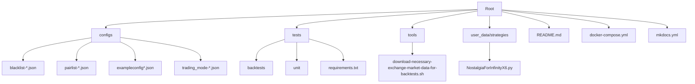
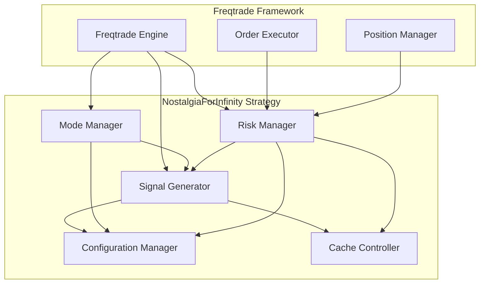
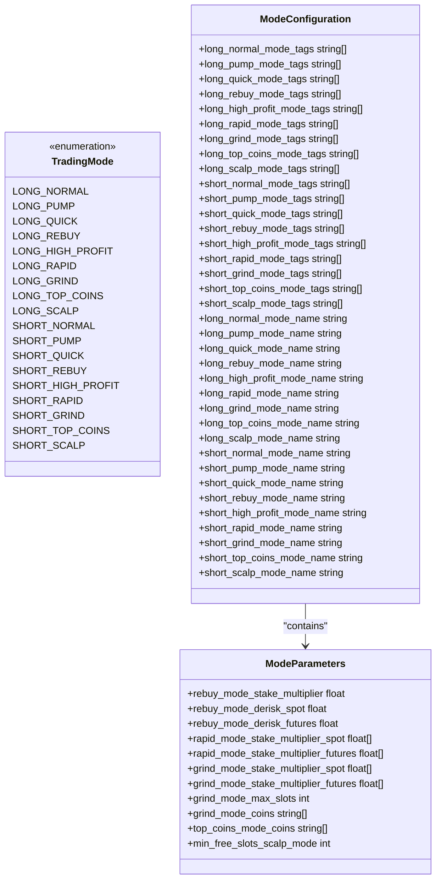

加密货币（特别是比特币 BTC）已全面融入全球宏观金融体系。要准确判断加密市场的整体趋势，需要将其视为“对全球法币流动性极度敏感的高贝塔（High-Beta）风险资产”。

以下为您梳理核心宏观指标、判断逻辑、事件分类影响，以及相应的逻辑推导图表。

---

### 一、 核心宏观指标与判断逻辑

判断加密市场的宏观环境，主要围绕流动性（Money）、无风险成本（Rates）、避险/风险偏好（Risk）三个核心维度：

1. **美联储净流动性（Fed Net Liquidity）**
* **计算公式**：$\text{美联储资产负债表规模} - \text{美联储逆回购余额 (RRP)} - \text{财政部一般账户 (TGA)}$
* **逻辑**：逆回购（RRP）抽离市场资金，TGA 充水（政府发债收钱）会锁定流动性，TGA 泄洪（政府花钱）释放流动性。净流动性是加密市场最直接的“水龙头”。


2. **全球 M2 货币供给总量（Global M2）**
* **逻辑**：包含中美欧日等主要经济体的 M2。历史数据显示，BTC 价格与 Global M2 呈现高度正相关（被称为“法币印钞机”的度量衡）。


3. **美债真实收益率（US 10Y Real Yield）**
* **计算公式**：$10\text{年期名义国债收益率} - \text{通胀预期 (Breakeven Inflation)}$
* **逻辑**：BTC 是不产生利息的资产。真实利率上升，资金倾向于持有无风险美债；真实利率下降（甚至为负），资金被迫流向 BTC 和黄金寻找抗通胀收益。


4. **美元指数（DXY）**
* **逻辑**：美元是全球金融的融资货币。DXY 走强意味着全球美元流动性紧缩，风险资产受压；DXY 走弱利好加密货币。


---

### 二、 宏观事件影响方向分类总结

| 事件分类 | 典型宏观事件 | 市场传导机制 | 对加密市场影响 |
| --- | --- | --- | --- |
| **货币宽松** | 美联储降息、启动 QE、降准 | 降息导致借贷成本下降，央行扩表直接注水，无风险收益率下行 | **强利好**（行情主升浪） |
| **财政扩张** | TGA 余额快速消耗、大规模财政刺激政策 | 政府将国库资金投入市场，短期商业银行流动性暴增 | **利好**（短中期流动性反弹） |
| **货币紧缩** | 鹰派加息、缩表（QT）、通胀（CPI/PCE）超预期 | 资金成本上升，流动性回流央行，风险资产估值承压 | **利空**（压制估值，进入熊市/震荡） |
| **流动性抽水** | 美债大规模集中发债（充实 TGA） | 市场资金被吸引去购买美债，挤压二级市场风险资金 | **短期利空**（流动性收紧） |
| **地缘/避险** | 局部战争、传统银行危机（如 SVB 倒闭） | 传统金融系统信任危机驱动资金流入 BTC（避险）；若引发流动性恐慌则先随大盘暴跌 | **复杂**：短期流动性危机利空，中长期“数字黄金”避险叙事利好 |

---

### 三、 宏观分析与趋势判断逻辑图

#### 1. 宏观传导逻辑全景图

```
                       [宏观政策 / 经济数据]
                                 │
         ┌───────────────────────┴───────────────────────┐
         ▼                                               ▼
  【央行货币政策 (Fed)】                           【财政部政策 (Treasury)】
  (利率政策 / QE / QT)                            (发债规模 / TGA 账户)
         │                                               │
         ├───────────────────────┬───────────────────────┤
         ▼                       ▼                       ▼
   [名义利率 / 降息]       [美联储资产负债表]      [TGA与RRP释放/锁定]
         │                       │                       │
         └───────────────────────┼───────────────────────┘
                                 ▼
                    【 市场实际净流动性 (Net Liquidity) 】
                                 │
         ┌───────────────────────┴───────────────────────┐
         ▼                                               ▼
  ┌──────────────┐                               ┌──────────────┐
  │  真实利率下降  │                               │  美元指数DXY  │
  │ (Real Yield) │                               │    下降      │
  └──────┬───────┘                               └──────┬───────┘
         │                                               │
         └───────────────────────┬───────────────────────┘
                                 ▼
                     【 全球风险偏好 (Risk-On) 】
                                 │
                 ┌───────────────┴───────────────┐
                 ▼                               ▼
          [美股 / 纳斯达克]               [加密货币市场 (BTC/ETH)]

```

---

#### 2. 加密趋势研究与触发决策图（研究员视角）

当新的宏观事件发生时，可按以下流程路径进行趋势判断：

```
                             [ 宏观事件发生 ]
                             (如 CPI 公布 / FOMC 决议 / 财政部发债计划)
                                     │
                                     ▼
                            【 是否改变流动性预期？ 】
                                     │
                    ┌────────────────┴────────────────┐
                    ▼                                 ▼
                 【 是 】                           【 否 】
                    │                                 │
       ┌────────────┴────────────┐                    ▼
       ▼                         ▼              【 情绪面/技术面驱动 】
 【 流动性扩张 】          【 流动性收紧 】     (参考场内爆仓/杠杆率，看短线)
 (降息/扩表/TGA释放)      (加息/缩表/TGA抽水)
       │                         │
       ▼                         ▼
【 检查真实利率 & DXY 】   【 检查真实利率 & DXY 】
       │                         │
 ┌─────┴─────┐             ┌─────┴─────┐
 ▼           ▼             ▼           ▼
[真实利率下行] [真实利率上升] [真实利率上升] [真实利率下行]
 │           │             │           │
 ▼           ▼             ▼           ▼
【 趋势策略 】
 ├─ 强利好 (满仓/加杠杆) ──► 逻辑：水多且资金成本低 (典型牛市)
 ├─ 中性震荡 (结构性行情) ──► 逻辑：流动性增加但被无风险收益率抵消
 ├─ 强利空 (减仓/避险)   ──► 逻辑：水少且借贷成本极高 (典型熊市)
 └─ 防守反击 (密切观察)   ──► 逻辑：政策转向过渡期，等待信号确认

```

---

### 四、 实际研究中的落地建议

1. **不要看“名义利率”，看“真实利率”**：美联储降息并不必然意味着比特币大涨。如果降息是因为经济发生剧烈衰退（Recession），市场避险情绪升温且通胀快速回落，真实利率可能不降反升，导致加密资产随美股同步暴跌。
2. **盯紧 USDT/USDC 增量**：宏观流动性最终要转化为“稳定币的总供应量”。如果宏观利好铺天盖地，但场内稳定币总市值没有增长，说明外围资金并未真正通过合规通道（如 ETF 或稳定币）入场，行情多为衍生品轧空驱动的短期反弹而非宏观牛市。

```mermaid
flowchart TD
Start([Entry Signal Check]) --> L1["Long Condition 1: Enable?"]
L1 --> |Yes| L1A["Evaluate Long Condition 1"]
L1 --> |No| L2["Long Condition 2: Enable?"]
L1A --> L2
L2 --> |Yes| L2A["Evaluate Long Condition 2"]
L2 --> |No| L3["Long Condition 3: Enable?"]
L2A --> L3
L3 --> |Yes| L3A["Evaluate Long Condition 3"]
L3 --> |No| L4["Long Condition 4: Enable?"]
L3A --> L4
L4 --> |Yes| L4A["Evaluate Long Condition 4"]
L4 --> |No| L5["Long Condition 5: Enable?"]
L4A --> L5
L5 --> |Yes| L5A["Evaluate Long Condition 5"]
L5 --> |No| L6["Long Condition 6: Enable?"]
L5A --> L6
L6 --> |Yes| L6A["Evaluate Long Condition 6"]
L6 --> |No| L21["Long Condition 21: Enable?"]
L6A --> L21
L21 --> |Yes| L21A["Evaluate Long Condition 21"]
L21 --> |No| L41["Long Condition 41: Enable?"]
L21A --> L41
L41 --> |Yes| L41A["Evaluate Long Condition 41"]
L41 --> |No| L42["Long Condition 42: Enable?"]
L41A --> L42
L42 --> |Yes| L42A["Evaluate Long Condition 42"]
L42 --> |No| L43["Long Condition 43: Enable?"]
L42A --> L43
L43 --> |Yes| L43A["Evaluate Long Condition 43"]
L43 --> |No| L44["Long Condition 44: Enable?"]
L43A --> L44
L44 --> |Yes| L44A["Evaluate Long Condition 44"]
L44 --> |No| L45["Long Condition 45: Enable?"]
L44A --> L45
L45 --> |Yes| L45A["Evaluate Long Condition 45"]
L45 --> |No| L46["Long Condition 46: Enable?"]
L45A --> L46
L46 --> |Yes| L46A["Evaluate Long Condition 46"]
L46 --> |No| L61["Long Condition 61: Enable?"]
L46A --> L61
L61 --> |Yes| L61A["Evaluate Long Condition 61"]
L61 --> |No| L62["Long Condition 62: Enable?"]
L61A --> L62
L62 --> |Yes| L62A["Evaluate Long Condition 62"]
L62 --> |No| L101["Long Condition 101: Enable?"]
L62A --> L101
L101 --> |Yes| L101A["Evaluate Long Condition 101"]
L101 --> |No| L102["Long Condition 102: Enable?"]
L101A --> L102
L102 --> |Yes| L102A["Evaluate Long Condition 102"]
L102 --> |No| L103["Long Condition 103: Enable?"]
L102A --> L103
L103 --> |Yes| L103A["Evaluate Long Condition 103"]
L103 --> |No| L104["Long Condition 104: Enable?"]
L103A --> L104
L104 --> |Yes| L104A["Evaluate Long Condition 104"]
L104 --> |No| L120["Long Condition 120: Enable?"]
L104A --> L120
L120 --> |Yes| L120A["Evaluate Long Condition 120"]
L120 --> |No| L141["Long Condition 141: Enable?"]
L120A --> L141
L141 --> |Yes| L141A["Evaluate Long Condition 141"]
L141 --> |No| L142["Long Condition 142: Enable?"]
L141A --> L142
L142 --> |Yes| L142A["Evaluate Long Condition 142"]
L142 --> |No| L143["Long Condition 143: Enable?"]
L142A --> L143
L143 --> |Yes| L143A["Evaluate Long Condition 143"]
L143 --> |No| L144["Long Condition 144: Enable?"]
L143A --> L144
L144 --> |Yes| L144A["Evaluate Long Condition 144"]
L144 --> |No| L161["Long Condition 161: Enable?"]
L144A --> L161
L161 --> |Yes| L161A["Evaluate Long Condition 161"]
L161 --> |No| L162["Long Condition 162: Enable?"]
L161A --> L162
L162 --> |Yes| L162A["Evaluate Long Condition 162"]
L162 --> |No| L163["Long Condition 163: Enable?"]
L162A --> L163
L163 --> |Yes| L163A["Evaluate Long Condition 163"]
L163 --> |No| End([All Long Conditions Processed])
L163A --> End
End --> ShortStart([Short Entry Signal Check])
ShortStart --> S501["Short Condition 501: Enable?"]
S501 --> |Yes| S501A["Evaluate Short Condition 501"]
S501 --> |No| S502["Short Condition 502: Enable?"]
S501A --> S502
S502 --> |Yes| S502A["Evaluate Short Condition 502"]
S502 --> |No| S542["Short Condition 542: Enable?"]
S502A --> S542
S542 --> |Yes| S542A["Evaluate Short Condition 542"]
S542 --> |No| S603["Short Condition 603: Enable?"]
S542A --> S603
S603 --> |Yes| S603A["Evaluate Short Condition 603"]
S603 --> |No| S641["Short Condition 641: Enable?"]
S603A --> S641
S641 --> |Yes| S641A["Evaluate Short Condition 641"]
S641 --> |No| S642["Short Condition 642: Enable?"]
S641A --> S642
S642 --> |Yes| S642A["Evaluate Short Condition 642"]
S642 --> |No| S661["Short Condition 661: Enable?"]
S642A --> S661
S661 --> |Yes| S661A["Evaluate Short Condition 661"]
S661 --> |No| End2([All Conditions Processed])
S661A --> End2
```






